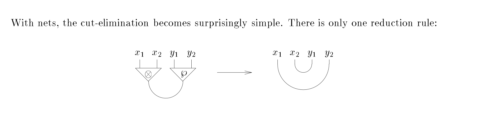

# Interaction Nets in Julia

## Overview

This project implements Interaction Nets, a graphical rewriting system based on linear logic, in the Julia programming language. Interaction Nets provide a powerful model for concurrent computation with strong theoretical foundations in linear logic.

## Interaction Net Diagram

The key operation in interaction nets is cut elimination, as shown in this diagram. "With nets, the cut-elimination becomes surprisingly simple. There is only one reduction rule:" (Lafont)

 (Lafont)

When two agents (tensor ⊗ and par ⅋) connect through their principal ports, they interact by creating direct connections between their auxiliary ports.

## Features

- **Pure Interaction Net Model**: Implementation closely following Lafont's original formulation
- **Linear Logic Primitives**: Support for multiplicative linear logic operators (tensor, par)
- **Concurrent Execution**: Multi-threaded implementation for parallel processing
- **Functional Programming**: List manipulation example with map operation
- **Hardware Optimization**: Efficient use of CPU cores and memory resources

## Structure

The project consists of two main files:

1. `InteractionNets.jl` - The core module implementing the interaction net formalism
2. `interaction_nets_examples.jl` - Example programs using the interaction nets framework

## Installation

1. Ensure you have Julia installed (version 1.6 or later recommended)
2. Clone this repository or download the files
3. No additional packages are required

## Usage

Run the examples with:

```bash
julia interaction_nets_examples.jl
```

## Implementing Your Own Agents and Rules

To create custom interaction net computations:

1. Define agent types with `create_agent` or similar factory functions
2. Define interaction rules for pairs of agent types
3. Connect agents through their ports
4. Run the network with `run_net`

Example:

```julia
# Create a net
net = Net(Agent[])

# Create agents
a = create_tensor(net)
b = create_par(net)

# Connect agents
connect(a.ports[1], b.ports[1])

# Run the computation
run_net(net)
```

## Linear Logic Semantics

Linear logic, introduced by Jean-Yves Girard in 1987, is a resource-conscious logic system that treats formulas as resources that must be consumed exactly once. This project implements a fragment of multiplicative linear logic (MLL), which includes these key operators:

- **Tensor (⊗)**: Represents the simultaneous availability of two resources. If you have A ⊗ B, you have both A and B simultaneously and must use both.

- **Par (⅋)**: Represents alternative availability of resources. If you have A ⅋ B, you must be prepared to handle either A or B (but not both).

- **Linear Implication (⊸)**: Can be defined as A ⊸ B ≡ A^⊥ ⅋ B, representing the consumption of resource A to produce resource B.

- **Duality (A^⊥)**: Each formula A has a dual A^⊥, where (A ⊗ B)^⊥ = A^⊥ ⅋ B^⊥ and (A ⅋ B)^⊥ = A^⊥ ⊗ B^⊥.

- **Cut Elimination**: The fundamental computational mechanism in linear logic. A cut (linking a formula with its dual) can be systematically eliminated through rewriting rules, corresponding to computation steps.

In this implementation, the tensor and par operators are directly represented as agents, and the cut elimination rule is implemented through their interaction:

```
(A ⊗ B) cut (A^⊥ ⅋ B^⊥) → (A cut A^⊥) ⊗ (B cut B^⊥) → 1
```

The complete reduction to the unit 1 happens in these steps:

1. First, the interaction between tensor and par formulas breaks down into two parallel cuts:
   (A ⊗ B) cut (A^⊥ ⅋ B^⊥) → (A cut A^⊥) ⊗ (B cut B^⊥)

2. Each cut between a formula and its dual reduces to the unit:
   - (A cut A^⊥) → 1
   - (B cut B^⊥) → 1

3. This gives us:
   1 ⊗ 1

4. The tensor of units further simplifies:
   1 ⊗ 1 → 1

This final reduction to 1 represents the complete consumption of all resources and successful termination of the computation.

#### Sequent Calculus Presentation

The cut elimination rule can also be expressed in sequent calculus notation. In the multiplicative linear logic sequent calculus:

```
Γ ⊢ A, Δ    Γ' ⊢ B, Δ'
------------------------ (⊗-right)
Γ, Γ' ⊢ A ⊗ B, Δ, Δ'

Θ, A, B ⊢ Λ
---------------- (⅋-left)
Θ, A ⅋ B ⊢ Λ

Γ, Γ' ⊢ A ⊗ B, Δ, Δ'    Θ, A^⊥ ⅋ B^⊥ ⊢ Λ
------------------------------------------ (cut)
Γ, Γ', Θ ⊢ Δ, Δ', Λ
```

The cut elimination process transforms this into:

```
Γ ⊢ A, Δ    Θ, A^⊥ ⊢ Λ'
------------------------ (cut)
Γ, Θ ⊢ Δ, Λ'

Γ' ⊢ B, Δ'    Θ', B^⊥ ⊢ Λ''
----------------------------- (cut)
Γ', Θ' ⊢ Δ', Λ''
```

Where Λ' and Λ'' are appropriate partitions of Λ, and similarly for Θ' and Θ.

The identity (axiom) rule in linear logic is:

```
---------- (axiom)
⊢ A, A^⊥
```

Which states that for any formula A, we can prove A or its dual A^⊥. In interaction net terms, this represents the potential connection between dual ports.

#### Reduction to Multiplicative Unit

The complete cut elimination process ultimately reduces to the multiplicative unit 1 (representing "no resources" or "done"). This happens through the following steps:

1. When the cut rule is applied to the identity axioms:

```
⊢ A, A^⊥    A, A^⊥ ⊢
---------------------- (cut)
⊢
```

2. This empty sequent (⊢) is equivalent to proving the multiplicative unit 1:

```
⊢ = ⊢ 1
```

3. In interaction nets, this corresponds to the annihilation of dual agents, leaving no active pairs. The rules for the multiplicative unit are:

```
-------- (1-right)
⊢ 1

Γ ⊢ Δ
--------- (1-left)
Γ, 1 ⊢ Δ
```

The reduction of complex formulas to the unit 1 through cut elimination represents the successful completion of computation in the interaction net model, where all active pairs have been processed and all resources have been properly consumed.

### Tensor and Par Implementation

The tensor and par agents are implemented as follows:

```julia
function tensor_rule(self, other)
    if other.type == :par
        println("Executing tensor * par interaction rule")
        # Connect auxiliary ports according to linear logic cut rule
        aux1_self, aux2_self = self.ports[2], self.ports[3]
        aux1_other, aux2_other = other.ports[2], other.ports[3]
        
        # Connect tensors with pars (linear cut elimination)
        connect(aux1_self, aux1_other)
        connect(aux2_self, aux2_other)
    else
        println("No interaction rule for tensor * $(other.type)")
    end
end

function par_rule(self, other)
    if other.type == :tensor
        println("Executing par * tensor interaction rule")
        # Symmetric to tensor_rule
        tensor_rule(other, self)
    else
        println("No interaction rule for par * $(other.type)")
    end
end

function create_tensor(net::Net)
    println("Creating tensor agent")
    agent = Agent(:tensor, 3, tensor_rule)  # One principal port + two auxiliary ports
    push!(net.agents, agent)
    return agent
end

function create_par(net::Net)
    println("Creating par agent")
    agent = Agent(:par, 3, par_rule)  # One principal port + two auxiliary ports
    push!(net.agents, agent)
    return agent
end
```

This implementation follows the linear logic cut elimination rule:

```
(A ⊗ B) ⅋ (A⊥ ⅋ B⊥) → (A ⅋ A⊥) ⊗ (B ⅋ B⊥) → 1
```

When tensor and par agents interact through their principal ports, their auxiliary ports are connected according to this rule, creating new potential interactions.

## Performance Considerations

The implementation includes several optimizations:
- Thread pooling for efficient parallel execution
- Memory pre-allocation for better performance
- Duplicate detection to prevent infinite loops
- Timeout controls to handle non-terminating computations

## Examples

### Multiplicative Linear Logic

Demonstrates cut elimination with tensor and par agents, showing how linear logic reductions can be modeled.

### List Mapping

Shows how functional programming concepts can be implemented, specifically mapping a function over a list using interaction nets.

## Contributing

Contributions are welcome! Some areas for improvement:
- Adding visualization tools
- Implementing more interaction net examples
- Further performance optimization
- Adding a proper test suite

## References

- Lafont, Y. (1990). "Interaction Nets"
- Lafont, Y. (1994). "From Proof-Nets to Interaction Nets"
- Girard, J.-Y. (1987). "Linear Logic"
- Mackie, I. (1998). "The Geometry of Implementation"
